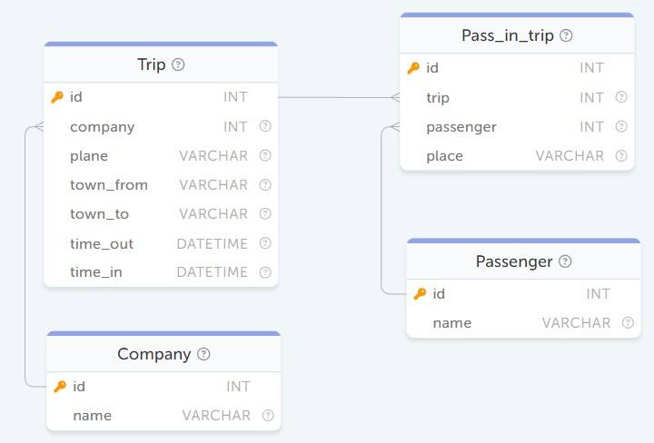

# SQL Academy задачи из курса
### Оглавление:

<br>

 - [**Модуль 2** Основы выборки I](#module-two)
   
   <details>
   <summary>Базовый синтаксис SQL запроса</summary>

    <!-- module-moduleNumber-chapterNumber-[insideChapterNumber]-taskNumber -->
    - [1. Вывод строки](#module-moduleTwo-chapterOne-task1)
    - [2. SELECT по всем столбцам](#module-moduleTwo-chapterOne-task2)
    - [3. SELECT по нескольким столбцам](#module-moduleTwo-chapterOne-task3)
    - [4. Вывод с псевдонимами](#module-moduleTwo-chapterOne-task4)

      <details>
      <summary>Применение функций</summary>

      - [1. Вывод строки в нижнем регистре](#module-moduleTwo-chapterOne-insideChapterOne-task1)
      - [2. Вывод года из даты](#module-moduleTwo-chapterOne-insideChapterOne-task2)
      - [3. Вычисление длины фамилии](#module-moduleTwo-chapterOne-insideChapterOne-task3)
      </details> 

      <details>
      <summary>Исключение дубликатов, DISTINCT</summary>

      - [1. Вывод уникальных имён](#module-moduleTwo-chapterOne-insideChapterTwo-task1)
      - [2. Вывод уникальных пар колонок](#module-moduleTwo-chapterOne-insideChapterTwo-task2)
      </details> 
   </details>

   <details>
      <summary>Условный оператор WHERE</summary>

      - [1. Простая фильтрация по числам](#module-moduleTwo-chapterTwo-task1)
      - [2. Простая фильтрация по строкам](#module-moduleTwo-chapterTwo-task2)
      - [3. Логическое ИЛИ](#module-moduleTwo-chapterTwo-task3)
      - [4. Логическое И](#module-moduleTwo-chapterTwo-task4)
        
        <details>
          <summary>Операторы IS NULL, BETWEEN, IN</summary>

        - [1. Вывод записей, содержащих NULL](#module-moduleTwo-chapterTwo-insideChapterOne-task1)
        - [2. Поиск значений в указанном промежутке](#module-moduleTwo-chapterTwo-insideChapterOne-task2)
        - [3. Поиск значений, входящий в определенный список](#module-moduleTwo-chapterTwo-insideChapterOne-task3)
        </details> 

        <details>
          <summary>Операторы LIKE</summary>

        - [1. Поиск по строковому шаблону](#module-moduleTwo-chapterTwo-insideChapterThree-task1)
        </details> 

    </details> 
    
   <details>
      <summary>Сортировка, оператор ORDER BY</summary>

      - [1. Сортировка по убыванию](#module-moduleTwo-chapterThree-task1)
      - [2. Сортировка по нескольким столбцам](#module-moduleTwo-chapterThree-task2)
   </details> 

   <details>
      <summary>Группировка, оператор GROUP BY</summary>

      - При группировке в SELECT можно выводить только литералы, результаты агрегатных функций и поля, по которым осуществлялась группировка
        
        <details>
          <summary>Агрегатные функции</summary>

        - [1. Группировка и сортировка](#module-moduleTwo-chapterFour-insideChapterOne-task1)
        - [2. Агрегатные функции MIN и MAX](#module-moduleTwo-chapterFour-insideChapterOne-task2)
        - [3. Агрегатная функция AVG](#module-moduleTwo-chapterFour-insideChapterOne-task3)
        - [4. Выборка с использованием нескольких агрегатных функций](#module-moduleTwo-chapterFour-insideChapterOne-task4)
        </details>

        <details>
          <summary>Оператор HAVING</summary>

        - [1. Группировка и сортировка](#module-moduleTwo-chapterFour-insideChapterTwo-task1)

        </details>
      </details> 
   </details>

<br>

 - [**Модуль 3** Основы выборки II](#module-three)
   <details>
    <summary>Многотабличные запросы, JOIN</summary>

    - []()

      <details>
       <summary>Внутреннее соединение INNER JOIN</summary>

      - [1. INNER JOIN](#module-moduleThree-chapterOne-insideChapterOne-task1)
      - [2. Многотабличный INNER JOIN](#module-moduleThree-chapterOne-insideChapterOne-task2)
      - [3. Многотабличный INNER JOIN с фильтрацией строк](#module-moduleThree-chapterOne-insideChapterOne-task3)
      - [4. INNER JOIN с группировкой](#module-moduleThree-chapterOne-insideChapterOne-task4)
     </details>

      <details>
       <summary>Внешнее соединение OUTER JOIN</summary>

      - [1. Внешнее левое соединение](#module-moduleThree-chapterOne-insideChapterTwo-task1)
     </details>
   </details>

   <details>
    <summary>Ограничение выборки, оператор LIMIT</summary>

      - [1. Ограничение записей с начала таблицы](#module-moduleThree-chapterTwo-task1)
      - [2. Ограничение количества записей со смещением](#module-moduleThree-chapterTwo-task2)
   </details>

   <details>
    <summary>Подзапросы</summary>

    - []()

      <details>
        <summary>Подзапрос с одной строкой с одним столбцом</summary>

      - [1. Поиск владельца](#module-moduleThree-chapterThree-insideChapterOne-task1)
      </details>

      <details>
        <summary>Подзапросы с несколькими строками и одним столбцом</summary>
        
      - [1. Столбцовые подзапросы с выражением IN](#module-moduleThree-chapterThree-insideChapterTwo-task1)
      </details>

      <details>
        <summary>Многостолбцовые подзапросы</summary>
        
      - [1. Строковые подзапросы](#module-moduleThree-chapterThree-insideChapterThree-task1)
      </details>

      <details>
        <summary>Коррелированные подзапросы</summary>
        
      - [1. Получение самого дорогого купленного товара](#module-moduleThree-chapterThree-insideChapterFour-task1)
      </details>
   </details>


   <details>
    <summary>Объединение запросов, оператор Union</summary>

      - [1. Объединение учеников и учителей](#module-moduleThree-chapterFive-task1)
   </details>

   <details>
    <summary>Условная логика, оператор CASE</summary>

      - [1. Категоризация отзывов](#module-moduleThree-chapterSix-task1)

         <details>
           <summary>Условная функция IF</summary>

        - [1. Условный вывод строки](#module-moduleThree-chapterSix-insideChapterOne-task1)
        - [2. Замена null на строку](#module-moduleThree-chapterSix-insideChapterOne-task2)

      
   </details>
   </details>

<br>

 - [**Модуль 4** Манипулирование данными](#module-four)

   <details>
   <summary>Добавление данных, оператор INSERT</summary>

    - [1. Добавление нового товара](#module-moduleFour-chapterOne-task1)
   </details>

   <details>
   <summary>Обновление данных, оператор UPDATE</summary>

    - [1. Обновление имени у пользователя](#module-moduleFour-chapterTwo-task1)
    - [2. Обновление стоимости у всего жилья](#module-moduleFour-chapterTwo-task2)
   </details>

   <details>
   <summary>Удаление данных, оператор DELETE</summary>

    - [1. Удаление всех записей](#module-moduleFour-chapterThree-task1)
    - [2. Удаление c условием](#module-moduleFour-chapterThree-task2)
    - [3. Удаление c JOIN](#module-moduleFour-chapterThree-task3)
   </details>

<br>

 - [**Модуль 5** Продвинутый SQL](#module-five)

   <details>
   <summary>Работа с типами данных</summary>

    - []()

      <details>
       <summary>Числовой тип данных</summary>

      - [1. Округление до чисел кратных 10-ти](#module-moduleFive-chapterOne-insideChapterOne-task1)
    </details>

      <details>
       <summary>Дата и время</summary>

      - [1. Функция STR_TO_DATE](#module-moduleFive-chapterOne-insideChapterTwo-task1)
      - [2. Определение возраста](#module-moduleFive-chapterOne-insideChapterTwo-task2)
    </details>
   </details>

   <details>
   <summary>Оконные функции</summary>

    - []()

      <details>
       <summary>Партиции в оконных функциях</summary>

      - [1. Минимальная стоимость жилья в текущей категории](#module-moduleFive-chapterThree-insideChapterOne-task1)
    </details>

      <details>
       <summary>Типы оконных функций</summary>

      - [1. Ранг жилья в текущей категории по цене](#module-moduleFive-chapterThree-insideChapterFour-task1)
      - [2. Время, прошедшее с предыдущего вылета](#module-moduleFive-chapterThree-insideChapterFour-task2)
    </details>
   </details>

<br>

 - [**Модуль 6** Базы данных и таблицы](#module-six)

   <details>
   <summary>Представления, VIEW</summary>

      - [1. Создание представления](#module-moduleSix-chapterOne-insideChapterOne-task1)

   </details>


<a id="module-two"></a>
## Модуль 2
## Базовый синтаксис SQL запроса

<a id="module-moduleTwo-chapterOne-task1"></a>
### 1. Вывод строки

С помощью оператора SELECT выведите текст "Hello world"
```sql
SELECT "Hello world"
```

<a id="module-moduleTwo-chapterOne-task2"></a>
### 2. SELECT по всем столбцам

Выведите все столбцы из таблицы `Payments`.
```sql
SELECT * FROM Payments
```

<a id="module-moduleTwo-chapterOne-task3"></a>
### 3. SELECT по нескольким столбцам

Выведите поля `member_id`, `member_name` и `status` из таблицы `FamilyMembers`.
```sql
SELECT member_id, member_name, status FROM FamilyMembers
```


<a id="module-moduleTwo-chapterOne-task4"></a>
### 4. Вывод с псевдонимами

Выведите поле name из таблицы `Passenger`. 

При выводе данного поля используйте псевдоним "passengerName"
```sql
SELECT name AS passengerName FROM Passenger
```



---
### Применение функций

<a id="module-moduleTwo-chapterOne-insideChapterOne-task1"></a>
### 1. Вывод строки в нижнем регистре

Выведите текст "Hello world" в нижнем регистре с помощью соответствующей функции.

Для вывода текста используйте псевдоним `lower_string`.
```sql
SELECT LOWER("Hello world") AS lower_string
```

<a id="module-moduleTwo-chapterOne-insideChapterOne-task2"></a>
### 2. Вывод года из даты

Выведите полное имя члена семьи и его год рождения, используя функцию YEAR.

Для вывода года рождения используйте псевдоним `year_of_birth`.
```sql
SELECT member_name, YEAR(birthday) AS year_of_birth FROM FamilyMembers
```

<a id="module-moduleTwo-chapterOne-insideChapterOne-task3"></a>
### 3. Вычисление длины фамилии

Выведите полное имя члена семьи и длину его фамилии.

Для вывода длины фамилии используйте псевдоним `lastname_length`.
```sql
SELECT member_name, LENGTH(member_name) - INSTR(member_name,' ') AS lastname_length FROM FamilyMembers
```

---
### Исключение дубликатов, DISTINCT

<a id="module-moduleTwo-chapterOne-insideChapterTwo-task1"></a>
### 1. Вывод уникальных имён

Выведите только уникальные имена `first_name` студентов из таблицы `Student`.
```sql
SELECT DISTINCT first_name FROM Student
```


<a id="module-moduleTwo-chapterOne-insideChapterTwo-task2"></a>
### 2. Вывод уникальных пар колонок

Выведите только уникальные пары значений идентификатор учителя `teacher` и идентификатор предмета `subject` из таблицы `Schedule`.
```sql
SELECT DISTINCT teacher, subject FROM Schedule
```


---
## Условный оператор WHERE

<a id="module-moduleTwo-chapterTwo-task1"></a>
### 1. Простая фильтрация по числам

Выведите идентификаторы товаров (поле `good`) из таблицы `Payments`, стоимость которых больше 2000 единиц. Стоимость товара хранится в поле `unit_price`.
```sql
SELECT good FROM Payments WHERE unit_price>2000
```

<a id="module-moduleTwo-chapterTwo-task2"></a>
### 2. Простая фильтрация по строкам

Выведите имена (поле `member_name`) членов семьи из таблицы `FamilyMembers`, чей статус (поле `status`) равен "father".
```sql
SELECT member_name FROM FamilyMembers WHERE status='father'
```

<a id="module-moduleTwo-chapterTwo-task3"></a>
### 3. Логическое ИЛИ

Выведите имя (поле `member_name`) и дату рождения (поле `birthday`) членов семьи из таблицы `FamilyMembers`, чей статус (поле `status`) равен "father" или "mother".
```sql
SELECT member_name, birthday FROM FamilyMembers WHERE status='father' OR status = 'mother'
```


<a id="module-moduleTwo-chapterTwo-task4"></a>
### 4. Логическое И

Необходимо получить все комнаты, в которых есть как кухня (поле `has_kitchen`), так и интернет (поле `has_internet`). Напишите запрос, удовлетворяющий вышеописанному условию, который выводит все поля из таблицы `Rooms`.
Наличие обозначается 1 или true, а отсутствие 0 или false.
```sql
SELECT * FROM Rooms WHERE has_kitchen=true AND has_internet=true
```


---
### Операторы IS NULL, BETWEEN, IN

<a id="module-moduleTwo-chapterTwo-insideChapterOne-task1"></a>
### 1. Вывод записей, содержащих NULL

Выведите имена `first_name` и фамилии `last_name` студентов из таблицы `Student`, у кого отсутствует отчество `middle_name`
```sql
SELECT first_name, last_name FROM Student WHERE middle_name IS NULL
```

<a id="module-moduleTwo-chapterTwo-insideChapterOne-task2"></a>
### 2. Поиск значений в указанном промежутке

Выведите резервации комнат (поля `room_id`, `start_date`, `end_date`) из таблицы `Reservations`, у которых итоговая стоимость аренды (поле `total`) находится в промежутке от 500 до 1200 включительно.
```sql
SELECT room_id, start_date, end_date FROM Reservations WHERE total BETWEEN 500 AND 1200
```

<a id="module-moduleTwo-chapterTwo-insideChapterOne-task3"></a>
### 3. Поиск значений, входящий в определенный список

Выведите информацию о студентах из таблицы Student, у которых год рождения соответствует одному из перечисленных: 2000, 2002 и 2004.
```sql
SELECT * FROM Student WHERE YEAR(birthday) IN (2000,2002,2004)
```


---
### Оператор LIKE

<a id="module-moduleTwo-chapterTwo-insideChapterTwo-task1"></a>
### 1. Поиск по строковому шаблону

Найдите всех членов семьи с фамилией "Quincey" и выведите поле `member_name`
```sql
SELECT member_name 
FROM FamilyMembers
WHERE member_name LIKE '%Quincey'
```


---
### Оператор REGEXP

<a id="module-moduleTwo-chapterTwo-insideChapterThree-task1"></a>
### 1. Поиск по подстроке

Найдите все жилые помещения (таблица `Rooms`), в адресе которых содержится строка «Avenue». В результирующей выборке выведите поля `id` и `address`.
```sql
SELECT id, address FROM Rooms WHERE address REGEXP '(Avenue)'
```

<a id="module-moduleTwo-chapterTwo-insideChapterThree-task2"></a>
### 2. Поиск по электронной почте

Выведите `name`, `email` пользователей, чей адрес электронной почты заканчивается на «@outlook.com» или «@live.com».
```sql
SELECT name, email FROM Users WHERE email REGEXP '@(outlook.com|live.com)$'
```


---
## Сортировка, оператор ORDER BY

<a id="module-moduleTwo-chapterThree-task1"></a>
### 1. Сортировка по убыванию

Для каждого отдельного платежа выведите идентификатор товара и сумму, потраченную на него, в отсортированном по убыванию этой суммы виде. Список платежей находится в таблице `Payments`.

Для вывода суммы используйте псевдоним `sum`.

```sql
SELECT 
    good, 
    unit_price*amount AS sum
FROM Payments 
ORDER BY 
    sum DESC;
```

<a id="module-moduleTwo-chapterThree-task2"></a>
### 2. Сортировка по нескольким столбцам

Выведите все данные членов семьи с фамилией Quincey из таблицы `FamilyMembers` и отсортируйте их по возрастанию сначала по столбцу `status`, а затем по `member_name`.
```sql
SELECT * FROM FamilyMembers
WHERE member_name LIKE '%Quincey'
ORDER BY status ASC, member_name ASC
```


---
## Группировка, оператор GROUP BY

### Агрегатные функции
<a id="module-moduleTwo-chapterFour-insideChapterOne-task1"></a>
### 1. Группировка и сортировка

Подсчитайте количество учеников в каждом классе, а также отсортируйте их по убыванию количества учеников. Принадлежность ученика к конкретному классу вы можете получить из таблицы `Student_in_class`. В качестве результата необходимо вывести идентификатор класса (поле `class`) и количество учеников в этом классе.

Для вывода количества учеников используйте псевдоним `count`.
```sql
SELECT class, COUNT(student) AS count 
FROM Student_in_class 
GROUP BY class 
ORDER BY count DESC
```

<a id="module-moduleTwo-chapterFour-insideChapterOne-task2"></a>
### 2. Агрегатные функции MIN и MAX

Для каждого из существующих статусов (поле `status`) найдите самого старого человека (используйте поле `birthday`). Выведите статус и дату рождения.

Для вывода даты рождения используйте псевдоним `birthday`.
```sql
SELECT status, MIN(birthday) AS birthday 
FROM FamilyMembers 
GROUP BY status
```

<a id="module-moduleTwo-chapterFour-insideChapterOne-task3"></a>
### 3. Агрегатная функция AVG

Получите среднее время полётов, совершённых на каждой из моделей самолёта. Выведите поле `plane` и среднее время полёта в **секундах**.

Для вывода времени используйте псевдоним `time`.

Используйте функцию `TIMESTAMPDIFF(second, time_out, time_in)`, чтобы получить разницу во времени в секундах между двумя датами.
```sql
SELECT plane, AVG(TIMESTAMPDIFF(second, time_out, time_in)) AS time 
FROM Trip 
GROUP BY plane
```

<a id="module-moduleTwo-chapterFour-insideChapterOne-task4"></a>
### 4. Выборка с использованием нескольких агрегатных функций

Выведите идентификатор комнаты (поле `room_id`), среднюю стоимость за один день аренды (поле `price`, для вывода используйте псевдоним `avg_price`), а также количество резерваций этой комнаты (используйте псевдоним `count`). Полученный результат отсортируйте в порядке убывания сначала по количеству резерваций, а потом по средней стоимости.
```sql
SELECT room_id, AVG(price) AS avg_price, COUNT(room_id) AS count 
FROM Reservations
GROUP BY room_id
ORDER BY count DESC, avg_price DESC
```


### Оператор HAVING
<a id="module-moduleTwo-chapterFour-insideChapterTwo-task1"></a>
### 1. Фильтрация групп

Выведите типы комнат (поле `home_type`) и разницу между самым дорогим и самым дешевым представителем данного типа. В итоговую выборку включите только те типы жилья, количество которых в таблице Rooms больше или равно 2.
Для вывода разницы стоимости используйте псевдоним `difference`.
```sql
SELECT home_type, (MAX(price)-MIN(price)) AS difference
FROM Rooms 
GROUP BY home_type
HAVING COUNT(home_type)>=2
```


<a id="module-three"></a>
## Модуль 3

### INNER JOIN
<a id="module-moduleThree-chapterOne-insideChapterOne-task1"></a>
### 1. INNER JOIN

Объедините таблицы `Class` и `Student_in_class` с помощью внутреннего соединения по полям `Class.id` и `Student_in_class.class`. Выведите название класса (поле `Class.name`) и идентификатор ученика (поле `Student_in_class.student`).
```sql
SELECT name, student FROM Class
INNER JOIN Student_in_class
ON Class.id = Student_in_class.class
```

<a id="module-moduleThree-chapterOne-insideChapterOne-task2"></a>
### 2. Многотабличный INNER JOIN

Дополните запрос из предыдущего задания, добавив ещё одно внутреннее соединение с таблицей `Student`. Объедините по полям `Student_in_class.student` и `Student.id` и вместо идентификатора ученика выведите его имя (поле `first_name`).
```sql
SELECT name, first_name FROM Class
INNER JOIN Student_in_class
ON Student_in_class.class=Class.id
INNER JOIN Student
ON Student_in_class.student=Student.id
```

<a id="module-moduleThree-chapterOne-insideChapterOne-task3"></a>
### 3. Многотабличный INNER JOIN с фильтрацией строк

Выведите названия продуктов, которые покупал член семьи со статусом "son". Для получения выборки вам нужно объединить таблицу `Payments` с таблицей `FamilyMembers` по полям `family_member` и `member_id`, а также с таблицей `Goods` по полям `good` и `good_id`.
```sql
SELECT good_name FROM Goods
INNER JOIN Payments
ON Payments.good=Goods.good_id
INNER JOIN FamilyMembers
ON FamilyMembers.member_id=Payments.family_member
WHERE FamilyMembers.status='son'
```

<a id="module-moduleThree-chapterOne-insideChapterOne-task4"></a>
### 4. INNER JOIN с группировкой

Выведите идентификатор (поле `room_id`) и среднюю оценку комнаты (поле `rating`, для вывода используйте псевдоним `avg_score`), составленную на основании отзывов из таблицы `Reviews`.

Данная таблица связана с `Reservations` (таблица, где вы можете взять идентификатор комнаты) по полям `reservation_id` и `Reservations.id`.
```sql
SELECT good_name FROM Goods
INNER JOIN Payments
ON Payments.good=Goods.good_id
INNER JOIN FamilyMembers
ON FamilyMembers.member_id=Payments.family_member
WHERE FamilyMembers.status='son'
```


### OUTER JOIN
<a id="module-moduleThree-chapterOne-insideChapterTwo-task1"></a>
### 1. Внешнее левое соединение

Выведите имя `first_name` и фамилию `last_name` каждого учителя из таблицы `Teacher`, а также количество занятий, в которых он был назначен преподавателем. Если преподаватель не был назначен ни на одно занятие, то выведите 0.

Для вывода количества занятий используйте псевдоним `amount_classes`.
```sql
SELECT Teacher.first_name, Teacher.last_name, COUNT(Schedule.id) AS amount_classes 
FROM Teacher
LEFT JOIN Schedule
ON Teacher.id=Schedule.teacher
GROUP BY Teacher.id
```

## Ограничение выборки, оператор LIMIT
<a id="module-moduleThree-chapterTwo-task1"></a>
### 1. Ограничение записей с начала таблицы

Отсортируйте список компаний (таблица `Company`) по их названию в алфавитном порядке и выведите первые **две** записи.
```sql
SELECT * FROM Company
ORDER BY name
LIMIT 2
```

<a id="module-moduleThree-chapterTwo-task2"></a>
### 2. Ограничение количества записей со смещением

Выведите начало (поле `start_pair`) и окончание (поле `end_pair`) второго и третьего занятия из таблицы `Timepair`.
```sql
SELECT start_pair, end_pair 
FROM Timepair
LIMIT 2 OFFSET 1
```


## Подзапросы
### Подзапрос с одной строкой с одним столбцом
<a id="module-moduleThree-chapterThree-insideChapterOne-task1"></a>
### 1. Поиск владельца

Выведите всю информацию о пользователе из таблицы `Users`, кто является владельцем самого дорогого жилья (таблица `Rooms`).
```sql
SELECT * FROM Users WHERE id = (
    SELECT owner_id FROM Rooms 
    ORDER BY price DESC
    LIMIT 1
)
```


### Подзапросы с несколькими строками и одним столбцом
<a id="module-moduleThree-chapterThree-insideChapterTwo-task1"></a>
### 1. Столбцовые подзапросы с выражением IN

Выведите названия товаров из таблицы `Goods` (поле `good_name`), которые ещё ни разу не покупались ни одним из членов семьи (таблица `Payments`).
```sql
SELECT good_name FROM Goods WHERE good_id NOT IN (
    SELECT good FROM Payments
)
```


### Многостолбцовые подзапросы
<a id="module-moduleThree-chapterThree-insideChapterThree-task1"></a>
### 1. Строковые подзапросы

Выведите список комнат (все поля, таблица `Rooms`), которые по своим удобствам (`has_tv`, `has_internet`, `has_kitchen`, `has_air_con`) совпадают с комнатой с идентификатором "11".
```sql
SELECT * FROM Rooms WHERE (has_tv, has_internet, has_kitchen, has_air_con) IN (SELECT has_tv, has_internet, has_kitchen, has_air_con FROM Rooms WHERE id=11)
```


### Коррелированные подзапросы
<a id="module-moduleThree-chapterThree-insideChapterFour-task1"></a>
### 1. Получение самого дорогого купленного товара

С помощью коррелированного подзапроса выведите имена всех членов семьи (`member_name`) и цену их самого дорогого купленного товара.

Для вывода цены самого дорогого купленного товара используйте псевдоним `good_price`. Если такого товара нет, выведите `NULL`.
```sql
SELECT member_name,
(
    SELECT MAX(unit_price*amount) 
    FROM Payments
    WHERE FamilyMembers.member_id=Payments.family_member
)
AS good_price 
FROM FamilyMembers
```


## Объединение запросов, оператор Union
<a id="module-moduleThree-chapterFive-task1"></a>
### 1. Объединение учеников и учителей

Выведите полные имена (поля `first_name`, `middle_name` и `last_name`) всех студентов и преподавателей.
```sql
SELECT first_name, middle_name, last_name FROM Student
UNION
SELECT first_name, middle_name, last_name FROM Teacher
```


## Условная логика, оператор CASE
<a id="module-moduleThree-chapterSix-task1"></a>
### 1. Категоризация отзывов

Из таблицы `Reviews` выведите идентификаторы отзывов (поле `id`) и их категорию: для рейтинга 4-5 проставьте категорию «positive», для 3 проставьте «neutral», а для 1-2 - «negative».

Для вывода категории рейтинга используйте псевдоним `rating`.
```sql
SELECT id, 
CASE
    WHEN rating IN(4,5) THEN "positive"
    WHEN rating=3 THEN "neutral"
    WHEN rating IN(1,2) THEN "negative"
END AS rating
FROM Reviews
```

### Условная функция IF
<a id="module-moduleThree-chapterSix-insideChapterOne-task1"></a>
### 1. Условный вывод строки

Из таблицы `Rooms` выведите идентификаторы сдаваемых жилых помещений (поле `id`) и наличие телевизора в помещении: если телевизор присутствует выведите «YES», иначе «NO».

Для вывода наличия телевизора используйте псевдоним `has_tv`.
```sql
SELECT id, 
    IF(has_tv, "YES", "NO") AS has_tv
FROM Rooms
```


<a id="module-moduleThree-chapterSix-insideChapterOne-task2"></a>
### 2. Замена null на строку

Из таблицы `Teacher` выведите имена (поле `first_name`), отчества (поле `middle_name`) и фамилии (поле `last_name`) учителей. Если отчество у учителя отсутствует, выведите в поле `middle_name` значение «Empty».
```sql
SELECT first_name, IFNULL(middle_name, "Empty") AS middle_name, last_name FROM Teacher
```


<a id="module-four"></a>
## Модуль 4

## Добавление данных, оператор INSERT
<a id="module-moduleFour-chapterOne-task1"></a>
### 1. Добавление нового товара

Добавьте новый товар в таблицу `Goods` с именем «Table» и типом «equipment».
В качестве первичного ключа (`good_id`) укажите количество записей в таблице + 1.
```sql
INSERT INTO Goods 
VALUES(
        (SELECT * FROM (SELECT COUNT(*) FROM Goods) AS temp)+1, 
        "Table", 
        (SELECT good_type_id FROM GoodTypes WHERE good_type_name="equipment")
)
```


## Обновление данных, оператор UPDATE
<a id="module-moduleFour-chapterTwo-task1"></a>
### 1. Обновление имени у пользователя

Измените имя у "Wednesday Addams" на новое "Tuesday Addams".
```sql
UPDATE FamilyMembers 
SET member_name="Tuesday Addams" 
WHERE member_name = "Wednesday Addams"
```

<a id="module-moduleFour-chapterTwo-task2"></a>
### 2. Обновление стоимости у всего жилья

Обновите стоимость всех комнат в таблице (`Rooms`), добавив к текущей 10 единиц.
```sql
UPDATE Rooms SET price=price+10
```

## Удаление данных, оператор DELETE
<a id="module-moduleFour-chapterThree-task1"></a>
### 1. Удаление всех записей

Удалите все записи из таблицы `Payments`, используя оператор `DELETE`.
```sql
DELETE FROM Payments
```

<a id="module-moduleFour-chapterThree-task2"></a>
### 2. Удаление c условием

Удалить запись из таблицы `Goods`, у которой поле good_name равно "milk"
```sql
DELETE FROM Goods WHERE good_name='milk'
```

<a id="module-moduleFour-chapterThree-task3"></a>
### 3. Удаление c JOIN

Измените запрос так, чтобы удалить товары (`Goods`), имеющие тип деликатесов (`delicacies`).
```sql
DELETE Goods FROM Goods 
JOIN GoodTypes ON Goods.type = GoodTypes.good_type_id 
WHERE GoodTypes.good_type_name = "delicacies"
```

<a id="module-five"></a>
## Модуль 5

## Работа с типами данных

### Числовой тип данных
<a id="module-moduleFive-chapterOne-insideChapterOne-task1"></a>
### 1. Округление до чисел кратных 10-ти

Выведите список цен всего доступного жилья (из таблицы `Rooms`), округлённых к ближайшему кратному 10-ти числу. Например, если цена равна "9676", то после округления она будет равна "9680".

Для вывода цены используйте псевдоним `rounded_price`.
```sql
SELECT ROUND(price, -1) AS rounded_price FROM Rooms
```

### Дата и время
<a id="module-moduleFive-chapterOne-insideChapterTwo-task1"></a>
### 1. Функция STR_TO_DATE

Пропишите формат строки во втором аргументе функции `STR_TO_DATE`, чтобы функция корректно отработала и вернула дату, на основании переданной первым аргументом строки.
```sql
SELECT STR_TO_DATE('Date: 31 December 2023', 'Date: %d %M %Y') AS date
```

<a id="module-moduleFive-chapterOne-insideChapterTwo-task2"></a>
### 2. Определение возраста

Выведите имена (поле `member_name`) и возраст для каждого человека из таблицы `FamilyMembers`.
Для вывода возраста используйте псевдоним `age`.
```sql
SELECT member_name, TIMESTAMPDIFF(YEAR, birthday, NOW()) AS age FROM FamilyMembers
```


## Оконные функции
### Партиции в оконных функциях
<a id="module-moduleFive-chapterThree-insideChapterOne-task1"></a>
### 1. Минимальная стоимость жилья в текущей категории

Из таблицы `Rooms` вывести поля `home_type` и `price`, а также добавить колонку `min_price_by_type`, в которой необходимо вывести минимальную стоимость жилья для текущего типа жилья (`home_type`). Для вычисления минимальной стоимости нужно использовать оконную функцию MIN.
```sql
SELECT home_type, 
       price,
       MIN(price) OVER (PARTITION BY home_type) AS min_price_by_type 
       FROM Rooms
```


### Типы оконных функций
<a id="module-moduleFive-chapterThree-insideChapterFour-task1"></a>
### 1. Ранг жилья в текущей категории по цене

Из таблицы `Rooms` вывести `id`, `home_type` и `price` у всех жилых помещений, а также в отдельной колонке `room_rank` вывести ранг данного жилого помещения в его категории (`home_type`) по цене, используя для этого функцию `DENSE_RANK` так, чтобы самое дешёвое жилое помещение имело ранг `1`, следующие за ним по цене — `2` и так далее.
```sql
SELECT id, 
       home_type, 
       price, 
       DENSE_RANK() OVER(PARTITION BY home_type ORDER BY price) AS room_rank 
FROM Rooms
```


<a id="module-moduleFive-chapterThree-insideChapterFour-task2"></a>
### 2. Время, прошедшее с предыдущего вылета

Дополните запрос так, чтобы найти разницу во времени между вылетами среди рейсов одной компании.
В качестве результирующей выборки выведите идентификаторы компаний (в поле `company`), время вылета их рейсов (в поле `time_out`) и время (в поле `time_diff`), прошедшее с предыдущего вылета в формате ЧЧ-MM-СС. Если это был первый рейс компании, то в поле `time_diff` нужно вывести "00:00:00".
```sql
SELECT 
    company,
    time_out,
    TIMEDIFF(
        time_out,
        FIRST_VALUE(time_out) OVER (
            PARTITION by company
            ORDER BY time_out
            ROWS BETWEEN 1 PRECEDING AND CURRENT ROW
        )
    ) AS time_diff
FROM Trip
```


<a id="module-six"></a>
## Модуль 6

## Представления, VIEW
<a id="module-moduleSix-chapterOne-insideChapterOne-task1"></a>
### 1. Создание представления

На основании таблицы `Student` создайте представление `ViewStudent`, содержащие только поля `id`, `first_name` и `last_name`.
```sql
CREATE VIEW ViewStudent AS
    SELECT id, first_name, last_name FROM Student
```