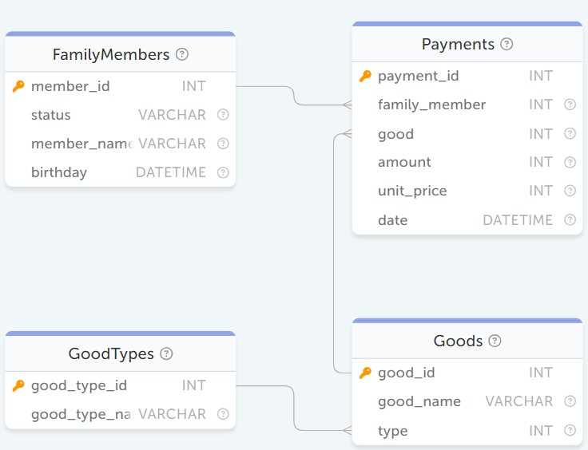
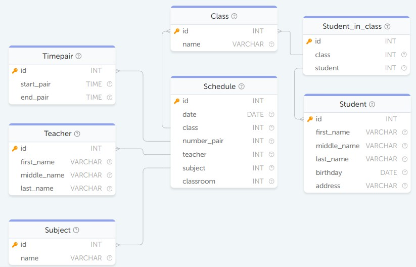
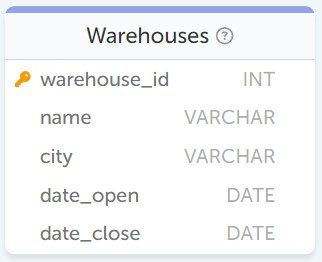

# Задания SQL тренажёра
<details>
    <summary>Авиаперелёты</summary>
    <figure>
        <br>
        <figcaption>Схема БД <span>Авиаперелётов</span></figcaption>
    </figure>

<dl>
<dd>
<details>
    <summary class="easy p-level">Легкие</summary>

- [#1 Вывести имена всех людей, которые есть в базе данных авиакомпаний](#moduleAirTravel-levelEasy-task1)
- [#2 Вывести названия всеx авиакомпаний](#moduleAirTravel-levelEasy-task2)
- [#3 Вывести все рейсы, совершенные из Москвы](#moduleAirTravel-levelEasy-task3)
- [#4 Вывести имена людей, которые заканчиваются на "man"](#moduleAirTravel-levelEasy-task4)
- [#5 Вывести количество рейсов, совершенных на TU-134](#moduleAirTravel-levelEasy-task5)
- [#6 Какие компании совершали перелеты на Boeing](#moduleAirTravel-levelEasy-task6)
- [#7 Вывести все названия самолётов, на которых можно улететь в Москву (Moscow)](#moduleAirTravel-levelEasy-task7)
- [#9 Какие компании организуют перелеты из Владивостока (Vladivostok)?](#moduleAirTravel-levelEasy-task9)
- [#12 Вывести id и количество пассажиров для всех прошедших полётов](#moduleAirTravel-levelEasy-task12)
- [#14 В какие города летал Bruce Willis](#moduleAirTravel-levelEasy-task14)
- [#15 Выведите дату и время прилёта пассажира Стив Мартин (Steve Martin) в Лондон (London)](#moduleAirTravel-levelEasy-task15)
- [#28 Сколько рейсов совершили авиакомпании из Ростова (Rostov) в Москву (Moscow) ?](#moduleAirTravel-levelEasy-task28)
- [#56 Удалить все перелеты, совершенные из Москвы (Moscow).](#moduleAirTravel-levelEasy-task56)

</details>

<details>
    <summary class="medium p-level">Средние</summary>

- [#8 В какие города можно улететь из Парижа (Paris) и сколько времени это займёт?](#moduleAirTravel-levelMedium-task8)
- [#10 Вывести вылеты, совершенные с 10 ч. по 14 ч. 1 января 1900 г.](#moduleAirTravel-levelMedium-task10)
- [#11 Выведите пассажиров с самым длинным ФИО. Пробелы, дефисы и точки считаются частью имени.](#moduleAirTravel-levelMedium-task11)
- [#13 Вывести имена людей, у которых есть полный тёзка среди пассажиров](#moduleAirTravel-levelMedium-task13)
- [#16 Вывести отсортированный по количеству перелетов (по убыванию) и имени (по возрастанию) список пассажиров, совершивших хотя бы 1 полет.](#moduleAirTravel-levelMedium-task16)
- [#29 Выведите имена пассажиров улетевших в Москву (Moscow) на самолете TU-134](#moduleAirTravel-levelMedium-task29)
- [#30 Выведите нагруженность (число пассажиров) каждого рейса (trip). Результат вывести в отсортированном виде по убыванию нагруженности.](#moduleAirTravel-levelMedium-task30)
- [#67 Вывести время отлета и время прилета для каждого перелета в формате "ЧЧ:ММ, ДД.ММ - ЧЧ:ММ, ДД.ММ", где часы и минуты с ведущим нулем, а день и месяц без.](#moduleAirTravel-levelMedium-task67)

</details>

<details>
    <summary class="hard p-level">Сложные</summary>

- [#55 Удалить компании, совершившие наименьшее количество рейсов.](#moduleAirTravel-levelHard-task55)


</details>

</dl>
</details> 


<details>
    <summary>Семья</summary>
    <figure>
        
        <figcaption>Схема БД <span>Семьи</span></figcaption>
    </figure>

<dl>
<dd>
<details>
    <summary class="easy p-level">Легкие</summary>

- [#19 Определить, кто из членов семьи покупал картошку (potato)](#moduleFamily-levelEasy-task19)
- [#22 Найти имена всех матерей (mother)](#moduleFamily-levelEasy-task22)
- [#53 Измените имя "Andie Quincey" на новое "Andie Anthony".](#moduleFamily-levelEasy-task53)

</details>

<details>
    <summary class="medium p-level">Средние</summary>

- [#17 Определить, сколько потратил в 2005 году каждый из членов семьи. В результирующей выборке не выводите тех членов семьи, которые ничего не потратили.](#moduleFamily-levelMedium-task17)
- [#18 Выведите имя самого старшего человека. Если таких несколько, то выведите их всех.](#moduleFamily-levelMedium-task18)
- [#20 Сколько и кто из семьи потратил на развлечения (entertainment). Вывести статус в семье, имя, сумму](#moduleFamily-levelMedium-task20)
- [#21 Определить товары, которые покупали более 1 раза](#moduleFamily-levelMedium-task21)
- [#23 Найдите самый дорогой деликатес (delicacies) и выведите его цену](#moduleFamily-levelMedium-task23)
- [#24 Определить кто и сколько потратил в июне 2005](#moduleFamily-levelMedium-task24)
- [#25 Определить, какие товары не покупались в 2005 году](#moduleFamily-levelMedium-task25)
- [#26 Определить группы товаров, которые не приобретались в 2005 году](#moduleFamily-levelMedium-task26)
- [#27 Узнайте, сколько было потрачено на каждую из групп товаров в 2005 году. Выведите название группы и потраченную на неё сумму. Если потраченная сумма равна нулю, т.е. товары из этой группы не покупались в 2005 году, то не выводите её.](#moduleFamily-levelMedium-task27)
- [#31 Вывести всех членов семьи с фамилией Quincey.](#moduleFamily-levelMedium-task31)
- [#32 Вывести средний возраст людей (в годах), хранящихся в базе данных. Результат округлите до целого в меньшую сторону.](#moduleFamily-levelMedium-task32)
- [#33 Найдите среднюю цену икры на основе данных, хранящихся в таблице Payments. В базе данных хранятся данные о покупках красной (red caviar) и черной икры (black caviar). В ответе должна быть одна строка со средней ценой всей купленной когда-либо икры.](#moduleFamily-levelMedium-task33)
- [#51 Добавьте товар с именем "Cheese" и типом "food" в список товаров (Goods).](#moduleFamily-levelMedium-task51)
- [#52 Добавьте в список типов товаров (GoodTypes) новый тип "auto".](#moduleFamily-levelMedium-task52)
- [#54 Удалить всех членов семьи с фамилией "Quincey".](#moduleFamily-levelMedium-task54)

</details>

</dl>
</details> 


<details>
    <summary>Расписание</summary>
    <figure>
        <br>
        <figcaption>Схема БД <span>Расписаний</span></figcaption>
    </figure>

<dl>
<dd>
<details>
    <summary class="easy p-level">Легкие</summary>

- [#34 Сколько всего 10-ых классов](#moduleSchedule-levelEasy-task34)
- [#36 Выведите информацию об обучающихся живущих на улице Пушкина (ul. Pushkina)?](#moduleSchedule-levelEasy-task36)
- [#38 Сколько Анн (Anna) учится в школе ?](#moduleSchedule-levelEasy-task38)
- [#39 Сколько обучающихся в 10 B классе ?](#moduleSchedule-levelEasy-task39)
- [#41 Выясните, во сколько по расписанию начинается четвёртое занятие.](#moduleSchedule-levelEasy-task41)
- [#75 Выведите фамилию, имя и дату рождения студентов, кто был рожден в мае.](#moduleSchedule-levelEasy-task75)
</details>

<details>
    <summary class="medium p-level">Средние</summary>

- [#35 Сколько различных кабинетов школы использовались 2 сентября 2019 года для проведения занятий?](#moduleSchedule-levelMedium-task35)
- [#37 Сколько лет самому молодому обучающемуся ?](#moduleSchedule-levelMedium-task37)
- [#40 Выведите название предметов, которые преподает Ромашкин П.П. (Romashkin P.P.). Обратите внимание, что в базе данных есть несколько учителей с такими фамилией и инициалами.](#moduleSchedule-levelMedium-task40)
- [#42 Сколько времени обучающийся будет находиться в школе, учась со 2-го по 4-ый уч. предмет?](#moduleSchedule-levelMedium-task42)
- [#43 Выведите фамилии преподавателей, которые ведут физическую культуру (Physical Culture). Отсортируйте преподавателей по фамилии в алфавитном порядке.](#moduleSchedule-levelMedium-task43)
- [#46 В каких классах введет занятия преподаватель "Krauze" ?](#moduleSchedule-levelMedium-task46)
- [#47 Сколько занятий провел Krauze 30 августа 2019 г.?](#moduleSchedule-levelMedium-task47)
- [#48 Выведите заполненность классов в порядке убывания](#moduleSchedule-levelMedium-task48)
- [#49 Какой процент обучающихся учится в "10 A" классе? Выведите ответ в диапазоне от 0 до 100 с округлением до четырёх знаков после запятой, например, 96.0201.](#moduleSchedule-levelMedium-task49)
- [#50 Какой процент обучающихся родился в 2000 году? Результат округлить до целого в меньшую сторону.](#moduleSchedule-levelMedium-task50)
- [#57 Перенести расписание всех занятий на 30 мин. вперед.](#moduleSchedule-levelMedium-task57)
- [#63 Выведите отсортированный список (по возрастанию) фамилий и имен студентов в виде Фамилия.И.](#moduleSchedule-levelMedium-task63)
- [#77 Создайте представление с именем "People", которое будет содержать список имен (first_name) и фамилий (last_name) всех студентов (Student) и преподавателей(Teacher)](#moduleSchedule-levelMedium-task77)

</details>

<details>
    <summary class="hard p-level">Сложные</summary>

- [#44 Найдите максимальный возраст (количество лет) среди обучающихся 10 классов на сегодняшний день. Для получения текущих даты и времени используйте функцию NOW().](#moduleSchedule-levelHard-task44)
- [#45 Какие кабинеты чаще всего использовались для проведения занятий? Выведите те, которые использовались максимальное количество раз.](#moduleSchedule-levelHard-task45)
- [#60 Выведите идентификаторы преподавателей, которые хотя бы один раз за всё время преподавали в каждом из одиннадцатых классов.](#moduleSchedule-levelHard-task60)

</details>

</dl>
</details> 


<details>
    <summary>Airbnb</summary>
    <figure>
        <br>
        <figcaption>Схема БД <span>Airbnb</span></figcaption>
    </figure>

<dl>
<dd>
<details>
    <summary class="easy p-level">Легкие</summary>

- [#74 Выведите идентификатор и признак наличия интернета в помещении. Если интернет в сдаваемом жилье присутствует, то выведите «YES», иначе «NO».](#moduleAirbnb-levelEasy-task74)

</details> 

<details>
    <summary class="medium p-level">Средние</summary>

- [#59 Вывести пользователей,указавших Белорусский номер телефона ? Телефонный код Белоруссии +375.](#moduleAirbnb-levelMedium-task59)
- [#61 Выведите список комнат, которые были зарезервированы хотя бы на одни сутки в 12-ую неделю 2020 года. В данной задаче в качестве одной недели примите период из семи дней, первый из которых начинается 1 января 2020 года. Например, первая неделя года — 1–7 января, а третья — 15–21 января.](#moduleAirbnb-levelMedium-task61)
- [#62 Вывести в порядке убывания популярности доменные имена 2-го уровня, используемые пользователями для электронной почты. Полученный результат необходимо дополнительно отсортировать по возрастанию названий доменных имён.](#moduleAirbnb-levelMedium-task62)
- [#64 Вывести количество бронирований по каждому месяцу каждого года, в которых было хотя бы 1 бронирование. Результат отсортируйте в порядке возрастания даты бронирования.](#moduleAirbnb-levelMedium-task64)
- [#65 Необходимо вывести рейтинг для комнат, которые хоть раз арендовали, как среднее значение рейтинга отзывов округленное до целого вниз.](#moduleAirbnb-levelMedium-task65)
- [#66 Вывести список комнат со всеми удобствами (наличие ТВ, интернета, кухни и кондиционера), а также общее количество дней и сумму за все дни аренды каждой из таких комнат.](#moduleAirbnb-levelMedium-task66)
- [#70 Необходимо категоризовать жилье на economy, comfort, premium по цене соответственно <= 100, 100 < цена < 200, >= 200. В качестве результата вывести таблицу с названием категории и количеством жилья, попадающего в данную категорию](#moduleAirbnb-levelMedium-task70)
- [#72 Выведите среднюю цену бронирования за сутки для каждой из комнат, которую бронировали хотя бы один раз. Среднюю цену необходимо округлить до целого значения вверх.](#moduleAirbnb-levelMedium-task72)
- [#73 Выведите id тех комнат, которые арендовали нечетное количество раз](#moduleAirbnb-levelMedium-task73)
- [#76 Вывести имена всех пользователей сервиса бронирования жилья, а также два признака: является ли пользователь собственником какого-либо жилья (is_owner) и является ли пользователь арендатором (is_tenant). В случае наличия у пользователя признака необходимо вывести в соответствующее поле 1, иначе 0.](#moduleAirbnb-levelMedium-task76)
- [#78 Выведите всех пользователей с электронной почтой в «hotmail.com»](#moduleAirbnb-levelMedium-task78)
- [#79 Выведите поля id, home_type, price у всего жилья из таблицы Rooms. Если комната имеет телевизор и интернет одновременно, то в качестве цены в поле price выведите цену, применив скидку 10%.](#moduleAirbnb-levelMedium-task79)
- [#80 Создайте представление «Verified_Users» с полями id, name и email, которое будет показывает только тех пользователей, у которых подтвержден адрес электронной почты.](#moduleAirbnb-levelMedium-task80)

</details> 

<details>
    <summary class="hard p-level">Сложные</summary>

- [#58 Добавить отзыв с рейтингом 5 на жилье, находящиеся по адресу "11218, Friel Place, New York", от имени "George Clooney"](#moduleAirbnb-levelHard-task58)
- [#68 Для каждой комнаты, которую снимали как минимум 1 раз, найдите имя человека, снимавшего ее последний раз, и дату, когда он выехал](#moduleAirbnb-levelHard-task68)
- [#69 Вывести идентификаторы всех владельцев комнат, что размещены на сервисе бронирования жилья и сумму, которую они заработали](#moduleAirbnb-levelHard-task69)
- [#71 Найдите какой процент пользователей, зарегистрированных на сервисе бронирования, хоть раз арендовали или сдавали в аренду жилье. Результат округлите до сотых.](#moduleAirbnb-levelHard-task71)

</details>

</dl>
</details> 


<details>
    <summary>Тестовые задания</summary>
    <figure>
        <br>
        <figcaption>Схема БД <span>Тестовое VK (1)</span></figcaption>
    </figure>
    <figure>
        <br>
        <figcaption>Схема БД <span>Тестовое VK (2)</span></figcaption>
    </figure>
    <figure>
        <br>
        <figcaption>Схема БД <span>Тестовое ДомКлик</span></figcaption>
    </figure>
    <figure>
        <br>
        <figcaption>Схема БД <span>Тестовое Сбербанк</span></figcaption>
    </figure>
    <figure>
        <br>
        <figcaption>Схема БД <span>Тестовое Самокат</span></figcaption>
    </figure>

<dl>
<dd>
<details>
    <summary class="easy p-level">Легкие</summary>

- [#99 Посчитай доход с женской аудитории (доход = сумма(price * items)). Обратите внимание, что в таблице женская аудитория имеет поле user_gender «female» или «f».](#moduleTest-levelEasy-task99)
- [#103 Вывести список имён сотрудников, получающих большую заработную плату, чем у непосредственного руководителя.](#moduleTest-levelEasy-task103)
- [#109 Выведите название страны, где находится город «Salzburg»](#moduleTest-levelEasy-task109)


</details> 

<details>
    <summary class="medium p-level">Средние</summary>

- [#93 Какой средний возраст клиентов, купивших Smartwatch (использовать наименование товара product.name) в 2024 году?](#moduleTest-levelMedium-task93)
- [#94 Вывести имена покупателей, каждый из которых приобрёл Laptop и Monitor (использовать наименование товара product.name) в марте 2024 года?](#moduleTest-levelMedium-task94)
- [#97 Посчитать количество работающих складов на текущую дату по каждому городу. Вывести только те города, у которых количество складов более 80. Данные на выходе - город, количество складов.](#moduleTest-levelMedium-task97)
- [#101 Выведи для каждого пользователя первое наименование, которое он заказал (первое по времени транзакции).](#moduleTest-levelMedium-task101)
- [#111 Посчитайте население каждого региона. В качестве результата выведите название региона и его численность населения.](#moduleTest-levelMedium-task111)

</details> 

</dl>
</details> 


## Авиаперелёты

<a id="moduleAirTravel-levelEasy-task1"></a>
### (Легко) #1 Вывести имена всех людей, которые есть в базе данных авиакомпаний

Поля в результирующей таблице:
`name`
```sql
SELECT name FROM Passenger
```

---

<a id="moduleAirTravel-levelEasy-task2"></a>
### (Легко) #2 Вывести названия всеx авиакомпаний

Поля в результирующей таблице:
`name`
```sql
SELECT name FROM Company
```

---

<a id="moduleAirTravel-levelEasy-task3"></a>
### (Легко) #3 Вывести все рейсы, совершенные из Москвы

Поля в результирующей таблице:
`*`
```sql
SELECT * FROM Trip WHERE town_from='Moscow'
```

---

<a id="moduleAirTravel-levelEasy-task4"></a>
### (Легко) #4 Вывести имена людей, которые заканчиваются на "man"

Поля в результирующей таблице:
`name`
```sql
SELECT name FROM Passenger where name like '%man'
```

---

<a id="moduleAirTravel-levelEasy-task5"></a>
### (Легко) #5 Вывести количество рейсов, совершенных на TU-134

Поля в результирующей таблице:
`count`

<span class="info" title="Дополнительная информация">&#128712;</span> Используйте конструкцию "as count" для агрегатной функции подсчета количества рейсов. Это необходимо для корректной проверки.

```sql
SELECT count(plane) AS count 
FROM Trip 
WHERE plane='TU-134'
```

---

<a id="moduleAirTravel-levelEasy-task6"></a>
### (Легко) #6 Какие компании совершали перелеты на Boeing

Поля в результирующей таблице:
`name`
```sql
SELECT DISTINCT name FROM Company
INNER JOIN Trip
ON Trip.company=Company.id
WHERE Trip.plane='Boeing'
```

---

<a id="moduleAirTravel-levelEasy-task7"></a>
### (Легко) #7 Вывести все названия самолётов, на которых можно улететь в Москву (Moscow)

Поля в результирующей таблице:
`plane`
```sql
SELECT DISTINCT plane FROM Trip WHERE town_to='Moscow'
```

---

<a id="moduleAirTravel-levelMedium-task8"></a>
### (Средне) #8 В какие города можно улететь из Парижа (Paris) и сколько времени это займёт?

Поля в результирующей таблице:
`town_to`
`flight_time`

<span class="info" title="Дополнительная информация">&#128712;</span> Используйте конструкцию "as flight_time" для вывода необходимого времени. Это необходимо для корректной проверки.

<span class="info" title="Дополнительная информация">&#128712;</span> Формат для вывода времени: HH:MM:SS


```sql
SELECT town_to, TIMEDIFF(time_in, time_out) AS flight_time FROM Trip
WHERE Trip.town_from='Paris'
```

---

<a id="moduleAirTravel-levelEasy-task9"></a>
### (Легко) #9 Какие компании организуют перелеты из Владивостока (Vladivostok)?

Поля в результирующей таблице:
`name`
```sql
SELECT name FROM Company
INNER JOIN Trip
ON Trip.company=Company.id
WHERE Trip.town_from='Vladivostok'
```
---

<a id="moduleAirTravel-levelMedium-task10"></a>
### (Средне) #10 Вывести вылеты, совершенные с 10 ч. по 14 ч. 1 января 1900 г.

Поля в результирующей таблице:
`*`
```sql
SELECT * FROM Trip
WHERE DATE(time_out) = "1900-01-01" AND 
     TIME(time_out) BETWEEN "10:00:00" AND "14:00:00"
```

---

<a id="moduleAirTravel-levelMedium-task11"></a>
### (Средне) #11 Выведите пассажиров с самым длинным ФИО. Пробелы, дефисы и точки считаются частью имени.

Поля в результирующей таблице:
`name`
```sql
-- SELECT name FROM Passenger
-- WHERE LENGTH(name)=(
--     SELECT LENGTH(name) as l_name FROM Passenger
--     ORDER BY l_name DESC
--     LIMIT 1
-- )

SELECT name FROM Passenger
WHERE LENGTH(name)=(
    SELECT MAX(LENGTH(name)) FROM Passenger
)
```

---

<a id="moduleAirTravel-levelEasy-task12"></a>
### (Легко) #12 Вывести id и количество пассажиров для всех прошедших полётов

Поля в результирующей таблице:
`trip`
`count`

<span class="info" title="Дополнительная информация">&#128712;</span> Используйте конструкцию "as count" для агрегатной функции подсчета количества пассажиров. Это необходимо для корректной проверки.

```sql
SELECT trip, COUNT(passenger) AS count
FROM Pass_in_trip 
GROUP BY trip
```

---

<a id="moduleAirTravel-levelMedium-task13"></a>
### (Средне) #13 Вывести имена людей, у которых есть полный тёзка среди пассажиров 

Поля в результирующей таблице:
`name`

```sql
SELECT name FROM Passenger
GROUP BY name
HAVING COUNT(name)>1
```

---

<a id="moduleAirTravel-levelEasy-task14"></a>
### (Легко) #14 В какие города летал Bruce Willis

Поля в результирующей таблице:
`town_to`
```sql
SELECT town_to FROM Trip
INNER JOIN Pass_in_trip
ON Pass_in_trip.trip=Trip.id
INNER JOIN Passenger
ON Passenger.id=Pass_in_trip.passenger
WHERE Passenger.name='Bruce Willis'
```

---

<a id="moduleAirTravel-levelEasy-task15"></a>
### (Легко) #15 Выведите дату и время прилёта пассажира Стив Мартин (Steve Martin) в Лондон (London)

Поля в результирующей таблице:
`time_in`
```sql
SELECT time_in FROM Trip

INNER JOIN Pass_in_trip
ON Pass_in_trip.trip = Trip.id

INNER JOIN Passenger
ON Passenger.id = Pass_in_trip.passenger

WHERE Passenger.name='Steve Martin' AND Trip.town_to='London'
```

---

<a id="moduleAirTravel-levelMedium-task16"></a>
### (Средне) #16 Вывести отсортированный по количеству перелетов (по убыванию) и имени (по возрастанию) список пассажиров, совершивших хотя бы 1 полет. 

Поля в результирующей таблице:
`name`
`count`

<span class="info" title="Дополнительная информация">&#128712;</span> Используйте конструкцию "as count" для агрегатной функции подсчета количества перелетов. Это необходимо для корректной проверки.

```sql
SELECT name, COUNT(Pass_in_trip.passenger) AS count FROM Pass_in_trip

INNER JOIN Passenger
ON Passenger.id = Pass_in_trip.passenger

GROUP BY Passenger.name
ORDER BY count DESC, name ASC
```

---

<a id="moduleAirTravel-levelEasy-task28"></a>
### (Легко) #28 Сколько рейсов совершили авиакомпании из Ростова (Rostov) в Москву (Moscow) ?

Поля в результирующей таблице:
`count`

<span class="info" title="Дополнительная информация">&#128712;</span> Используйте конструкцию "as count" для агрегатной функции подсчета количества рейсов. Это необходимо для корректной проверки.

```sql
SELECT COUNT(id) AS count FROM Trip WHERE town_from='Rostov' AND town_to='Moscow'
```

---

<a id="moduleAirTravel-levelMedium-task29"></a>
### (Средне) #29 Выведите имена пассажиров улетевших в Москву (Moscow) на самолете TU-134

Поля в результирующей таблице:
`name`
```sql
SELECT DISTINCT name FROM Passenger

INNER JOIN Pass_in_trip
ON Passenger.id = Pass_in_trip.passenger

INNER JOIN Trip
ON Pass_in_trip.trip = Trip.id

WHERE Trip.town_to='Moscow' AND Trip.plane='TU-134'
```

---

<a id="moduleAirTravel-levelMedium-task30"></a>
### (Средне) #30 Выведите нагруженность (число пассажиров) каждого рейса (trip). Результат вывести в отсортированном виде по убыванию нагруженности.

Поля в результирующей таблице:
`trip`
`count`

<span class="info" title="Дополнительная информация">&#128712;</span> Используйте конструкцию "as count" для агрегатной функции подсчета числа пассажиров на рейсе. Это необходимо для корректной проверки.

```sql
SELECT trip, 
      COUNT(passenger) AS count 
FROM Pass_in_trip

GROUP BY trip
ORDER BY count DESC
```

---

<a id="moduleAirTravel-levelHard-task55"></a>
### (Сложно) #55 Удалить компании, совершившие наименьшее количество рейсов.

```sql
DELETE c
FROM Company c
	LEFT JOIN (
		SELECT company,
			COUNT(*) AS trip_count
		FROM Trip
		GROUP BY company
	) temp ON c.id = temp.company
WHERE temp.trip_count = (
		SELECT MIN(trip_count)
		FROM (
				SELECT COUNT(*) AS trip_count
				FROM Trip
				GROUP BY company
			) AS subquery
	)
```

---

<a id="moduleAirTravel-levelEasy-task56"></a>
### (Легко) #56 Удалить все перелеты, совершенные из Москвы (Moscow).

```sql
DELETE FROM Trip 
WHERE town_from='Moscow'
```

---

<a id="moduleAirTravel-levelMedium-task67"></a>
### (Средне) #67 Вывести время отлета и время прилета для каждого перелета в формате "ЧЧ:ММ, ДД.ММ - ЧЧ:ММ, ДД.ММ", где часы и минуты с ведущим нулем, а день и месяц без.

Поля в результирующей таблице:
`flight_time`

<span class="info" title="Дополнительная информация">&#128712;</span> Используйте конструкции "as flight_time" для полученной строки с датами отлета и прилета.

Формат ожидаемого результата запроса:
||flight_time|
|-|-|
||flight_time|
|1|11:25, 3.11 - 16:50, 3.11|
|2|10:00, 3.1 - 11:00, 3.1|

```sql
SELECT CONCAT(
    DATE_FORMAT(time_out, '%H:%i, %e.%c'),
    ' - ',
    DATE_FORMAT(time_in, '%H:%i, %e.%c')
) AS flight_time 
FROM Trip
```


## Семья

<a id="moduleFamily-levelMedium-task17"></a>
### (Средне) #17 Определить, сколько потратил в 2005 году каждый из членов семьи. В результирующей выборке не выводите тех членов семьи, которые ничего не потратили.

Поля в результирующей таблице:
`member_name`
`status`
`costs`

<span class="info" title="Дополнительная информация">&#128712;</span> Используйте конструкцию "as costs" для отображения затраченной суммы членом семьи. Это необходимо для корректной проверки.

```sql
SELECT member_name, status, 
        SUM((Payments.unit_price*Payments.amount)) AS costs 
FROM FamilyMembers

INNER JOIN Payments
ON Payments.family_member = FamilyMembers.member_id

WHERE YEAR(Payments.date) = 2005
GROUP BY Payments.family_member
```

---

<a id="moduleFamily-levelMedium-task18"></a>
### (Средне) #18 Выведите имя самого старшего человека. Если таких несколько, то выведите их всех.

Поля в результирующей таблице:
`member_name`
```sql
SELECT member_name FROM FamilyMembers

WHERE TIMESTAMPDIFF(YEAR, birthday, NOW()) = (

    SELECT MAX(TIMESTAMPDIFF(YEAR, birthday, NOW())) AS age FROM FamilyMembers
    ORDER BY age DESC
    LIMIT 1

)
```

---

<a id="moduleFamily-levelEasy-task19"></a>
### (Легко) #19 Определить, кто из членов семьи покупал картошку (potato)

Поля в результирующей таблице:
`status`
```sql
SELECT DISTINCT status FROM FamilyMembers

INNER JOIN Payments
ON Payments.family_member = FamilyMembers.member_id

INNER JOIN Goods
ON Goods.good_id = Payments.good

WHERE Goods.good_name = 'potato'
```

---

<a id="moduleFamily-levelMedium-task20"></a>
### (Средне) #20 Сколько и кто из семьи потратил на развлечения (entertainment). Вывести статус в семье, имя, сумму

Поля в результирующей таблице:
`status`
`member_name`
`costs`

<span class="info" title="Дополнительная информация">&#128712;</span> Используйте конструкцию "as costs" для отображения затраченной суммы членом семьи. Это необходимо для корректной проверки.

```sql
SELECT status, 
       member_name, 
       SUM(amount*unit_price) AS costs 
FROM FamilyMembers

INNER JOIN Payments
ON Payments.family_member = FamilyMembers.member_id

INNER JOIN Goods
ON Goods.good_id = Payments.good

INNER JOIN GoodTypes
ON GoodTypes.good_type_id = Goods.type

WHERE GoodTypes.good_type_name = 'entertainment'
GROUP BY member_name, status
```

---

<a id="moduleFamily-levelMedium-task21"></a>
### (Средне) #21 Определить товары, которые покупали более 1 раза

Поля в результирующей таблице:
`good_name`
```sql
SELECT good_name FROM Payments

INNER JOIN Goods
ON Goods.good_id = Payments.good

GROUP BY Goods.good_name
HAVING COUNT(Goods.good_name) > 1
```

---

<a id="moduleFamily-levelEasy-task22"></a>
### (Легко) #22 Найти имена всех матерей (mother)

Поля в результирующей таблице:
`member_name`
```sql
SELECT member_name FROM FamilyMembers WHERE status='mother'
```

---

<a id="moduleFamily-levelMedium-task23"></a>
### (Средне) #23 Найдите самый дорогой деликатес (delicacies) и выведите его цену

Поля в результирующей таблице:
`good_name`
`unit_price`
```sql
SELECT good_name, unit_price FROM Payments

INNER JOIN Goods
ON Goods.good_id = Payments.good

INNER JOIN GoodTypes
ON GoodTypes.good_type_id = Goods.type

WHERE good_type_name='delicacies'

ORDER BY unit_price DESC
LIMIT 1
```

---

<a id="moduleFamily-levelMedium-task24"></a>
### (Средне) #24 Определить кто и сколько потратил в июне 2005

Поля в результирующей таблице:
`member_name`
`costs`

<span class="info" title="Дополнительная информация">&#128712;</span> Используйте конструкцию "as costs" для отображения затраченной суммы членом семьи. Это необходимо для корректной проверки.

```sql
SELECT member_name,
       SUM(unit_price*amount) AS costs 
FROM FamilyMembers

INNER JOIN Payments
ON Payments.family_member = FamilyMembers.member_id

WHERE MONTH(Payments.date)=6 AND YEAR(Payments.date)=2005
GROUP BY member_name
```

---

<a id="moduleFamily-levelMedium-task25"></a>
### (Средне) #25 Определить, какие товары не покупались в 2005 году

Поля в результирующей таблице:
`good_name`

<span class="info" title="Дополнительная информация">&#128712;</span> Все доступные к покупке продукты находятся в таблице Goods

```sql
SELECT good_name FROM Goods
WHERE Goods.good_id NOT IN (
    SELECT good FROM Payments
    WHERE YEAR(Payments.date)=2005
)
```

---

<a id="moduleFamily-levelMedium-task26"></a>
### (Средне) #26 Определить группы товаров, которые не приобретались в 2005 году

Поля в результирующей таблице:
`good_type_name`
```sql
SELECT good_type_name
FROM GoodTypes

WHERE GoodTypes.good_type_id NOT IN(
    SELECT type FROM Payments
    
    INNER JOIN Goods
    ON Goods.good_id = Payments.good
    
    WHERE YEAR(Payments.date) = 2005
)
```

---

<a id="moduleFamily-levelMedium-task27"></a>
### (Средне) #27 Узнайте, сколько было потрачено на каждую из групп товаров в 2005 году. Выведите название группы и потраченную на неё сумму. Если потраченная сумма равна нулю, т.е. товары из этой группы не покупались в 2005 году, то не выводите её.

Поля в результирующей таблице:
`good_type_name`
`costs`

<span class="info" title="Дополнительная информация">&#128712;</span> Используйте конструкцию "as costs" для отображения затраченной суммы на конкретную группу товаров. Это необходимо для корректной проверки.

```sql
SELECT good_type_name, SUM(unit_price*amount) AS costs FROM GoodTypes

INNER JOIN Goods
ON Goods.type = GoodTypes.good_type_id

INNER JOIN Payments
ON Payments.good = Goods.good_id

WHERE YEAR(Payments.date)=2005
GROUP BY good_type_name
```

---

<a id="moduleFamily-levelMedium-task31"></a>
### (Средне) #31 Вывести всех членов семьи с фамилией Quincey.

Поля в результирующей таблице:
`*`

```sql
SELECT * FROM FamilyMembers
WHERE member_name LIKE '%Quincey'
```

---

<a id="moduleFamily-levelMedium-task32"></a>
### (Средне) #32 Вывести средний возраст людей (в годах), хранящихся в базе данных. Результат округлите до целого в меньшую сторону.

Поля в результирующей таблице:
`age`

<span class="info" title="Дополнительная информация">&#128712;</span> Используйте конструкцию "as age" для агрегатной функции подсчета среднего возраста. Это необходимо для корректной проверки.

```sql
SELECT FLOOR(AVG(TIMESTAMPDIFF(YEAR, birthday, NOW()))) AS age 
FROM FamilyMembers
```

---

<a id="moduleFamily-levelMedium-task33"></a>
### (Средне) #33 Найдите среднюю цену икры на основе данных, хранящихся в таблице Payments. В базе данных хранятся данные о покупках красной (red caviar) и черной икры (black caviar). В ответе должна быть одна строка со средней ценой всей купленной когда-либо икры.

Поля в результирующей таблице:
`cost`

<span class="info" title="Дополнительная информация">&#128712;</span> Используйте конструкцию "as cost" для агрегатной функции подсчета средней цены икры. Это необходимо для корректной проверки.

```sql
SELECT AVG(unit_price) AS cost FROM Payments

INNER JOIN Goods
ON Goods.good_id = Payments.good

WHERE Goods.good_name LIKE '%caviar'
```

---

<a id="moduleFamily-levelMedium-task51"></a>
### (Средне) #51 Добавьте товар с именем "Cheese" и типом "food" в список товаров (Goods).

<span class="info" title="Дополнительная информация">&#128712;</span> В качестве первичного ключа (good_id) укажите количество записей в таблице + 1.

```sql
INSERT INTO Goods 
VALUES (
    (SELECT * FROM (SELECT COUNT(*) FROM Goods) AS t)+1,
    "Cheese",
    (SELECT good_type_id FROM GoodTypes WHERE good_type_name='food')
)
```

---

<a id="moduleFamily-levelMedium-task52"></a>
### (Средне) #52 Добавьте в список типов товаров (GoodTypes) новый тип "auto".

<span class="info" title="Дополнительная информация">&#128712;</span> В качестве первичного ключа (good_type_id) укажите количество записей в таблице + 1.

```sql
INSERT INTO GoodTypes
VALUES(
    (SELECT * FROM (SELECT COUNT(*) FROM GoodTypes) AS t)+1,
    'auto'    
)
```

---

<a id="moduleFamily-levelMedium-task54"></a>
### (Средне) #54 Удалить всех членов семьи с фамилией "Quincey".

```sql
DELETE FROM FamilyMembers
WHERE member_name LIKE '%Quincey'
```

---


## Расписание

<a id="moduleSchedule-levelEasy-task34"></a>
### (Легко) #34 Сколько всего 10-ых классов

Поля в результирующей таблице:
`count`

<span class="info" title="Дополнительная информация">&#128712;</span> Используйте конструкцию "as count" для агрегатной функции подсчета количества классов. Это необходимо для корректной проверки.

```sql
SELECT COUNT(name) AS count FROM Class 
WHERE name LIKE '%10%'
```

---

<a id="moduleSchedule-levelMedium-task35"></a>
### (Средне) #35 Сколько различных кабинетов школы использовались 2 сентября 2019 года для проведения занятий?

Поля в результирующей таблице:
`count`

<span class="info" title="Дополнительная информация">&#128712;</span> Используйте конструкцию "as count" для агрегатной функции подсчета количества различных кабинетов. Это необходимо для корректной проверки.

```sql
SELECT COUNT(DISTINCT classroom) AS count FROM Schedule
WHERE date='20190902'
```
---

<a id="moduleSchedule-levelEasy-task36"></a>
### (Легко) #36 Выведите информацию об обучающихся живущих на улице Пушкина (ul. Pushkina)?

Поля в результирующей таблице:
`*`

```sql
SELECT * FROM Student WHERE address LIKE '%ul. Pushkina%'
```

---

<a id="moduleSchedule-levelMedium-task37"></a>
### (Средне) #37 Сколько лет самому молодому обучающемуся ?

Поля в результирующей таблице:
`year`

<span class="info" title="Дополнительная информация">&#128712;</span> Используйте конструкцию "as year" для указания возраста учащегося. Это необходимо для корректной проверки.

```sql
SELECT TIMESTAMPDIFF(YEAR, birthday, NOW()) AS year FROM Student
ORDER BY year
LIMIT 1
```

---

<a id="moduleSchedule-levelEasy-task38"></a>
### (Легко) #38 Сколько Анн (Anna) учится в школе ?

Поля в результирующей таблице:
`count`

<span class="info" title="Дополнительная информация">&#128712;</span> Используйте конструкцию "as count" для агрегатной функции подсчета количества учащихся. Это необходимо для корректной проверки.

```sql
SELECT COUNT(id) AS count FROM Student WHERE first_name='Anna'
```

---

<a id="moduleSchedule-levelEasy-task39"></a>
### (Легко) #39 Сколько обучающихся в 10 B классе ?

Поля в результирующей таблице:
`count`

<span class="info" title="Дополнительная информация">&#128712;</span> Используйте конструкцию "as count" для агрегатной функции подсчета количества учащихся. Это необходимо для корректной проверки.

```sql
SELECT COUNT(student) AS count FROM Student_in_class
INNER JOIN Class
ON Student_in_class.class = Class.id
WHERE Class.name='10 B'
```

---

<a id="moduleSchedule-levelMedium-task40"></a>
### (Средне) #40 Выведите название предметов, которые преподает Ромашкин П.П. (Romashkin P.P.). Обратите внимание, что в базе данных есть несколько учителей с такими фамилией и инициалами.

Поля в результирующей таблице:
`subjects`

<span class="info" title="Дополнительная информация">&#128712;</span> Используйте конструкцию "as subjects" для указания учебных предметов. Это необходимо для корректной проверки.

```sql
SELECT Subject.name AS subjects FROM Schedule

INNER JOIN Teacher
ON Teacher.id = Schedule.teacher

INNER JOIN Subject
ON Subject.id = Schedule.subject

WHERE last_name='Romashkin' AND LEFT(middle_name,1)='P' AND LEFT(first_name,1)='P'
```

---

<a id="moduleSchedule-levelEasy-task41"></a>
### (Легко) #41 Выясните, во сколько по расписанию начинается четвёртое занятие.

Поля в результирующей таблице:
`start_pair`
```sql
SELECT DISTINCT start_pair FROM Schedule
INNER JOIN Timepair
ON Timepair.id = Schedule.number_pair
WHERE number_pair = 4
```

---

<a id="moduleSchedule-levelMedium-task42"></a>
### (Средне) #42 Сколько времени обучающийся будет находиться в школе, учась со 2-го по 4-ый уч. предмет?

Поля в результирующей таблице:
`time`

<span class="info" title="Дополнительная информация">&#128712;</span> Используйте конструкцию "as time" для указания разницы во времени. Это необходимо для корректной проверки.

<span class="info" title="Дополнительная информация">&#128712;</span> Результат должен быть в формате HH:MM:SS

```sql
SELECT TIMEDIFF(
    (SELECT end_pair FROM Timepair WHERE id=4),
    (SELECT start_pair FROM Timepair WHERE id=2)
) AS time
```

---

<a id="moduleSchedule-levelMedium-task43"></a>
### (Средне) #43 Выведите фамилии преподавателей, которые ведут физическую культуру (Physical Culture). Отсортируйте преподавателей по фамилии в алфавитном порядке.

Поля в результирующей таблице:
`last_name`
```sql
SELECT last_name FROM Teacher

INNER JOIN Schedule
ON Schedule.teacher = Teacher.id

INNER JOIN Subject
ON Subject.id = Schedule.subject

WHERE name = 'Physical Culture'
ORDER BY last_name
```

---

<a id="moduleSchedule-levelHard-task44"></a>
### (Сложно) #44 Найдите максимальный возраст (количество лет) среди обучающихся 10 классов на сегодняшний день. Для получения текущих даты и времени используйте функцию NOW().

Поля в результирующей таблице:
`max_year`

<span class="info" title="Дополнительная информация">&#128712;</span> Используйте конструкцию "as max_year" для указания максимального возраста в годах. Это необходимо для корректной проверки.

```sql
SELECT MAX(TIMESTAMPDIFF(YEAR, birthday, NOW())) AS max_year
FROM Student

INNER JOIN Student_in_class 
ON Student_in_class.student = Student.id

INNER JOIN Class ON Class.id = Student_in_class.class
AND Class.name LIKE '10%'

-- SELECT MAX(TIMESTAMPDIFF(YEAR, birthday, NOW())) AS max_year
-- FROM Student
-- WHERE Student.id IN (
-- 		SELECT student
-- 		FROM Student_in_class
-- 		WHERE class IN (
-- 				SELECT id
-- 				FROM Class
-- 				WHERE Class.name LIKE '10%'
-- 			)
-- 	)
```

---

<a id="moduleSchedule-levelHard-task45"></a>
### (Сложно) #45 Какие кабинеты чаще всего использовались для проведения занятий? Выведите те, которые использовались максимальное количество раз.

Поля в результирующей таблице:
`classroom`
```sql
SELECT classroom
FROM Schedule

GROUP BY classroom
HAVING COUNT(*) = (
		SELECT COUNT(*) AS COUNT
		FROM Schedule
		
        GROUP BY classroom
		ORDER BY COUNT DESC
		
        LIMIT 1
	)
```

---

<a id="moduleSchedule-levelMedium-task46"></a>
### (Средне) #46 В каких классах введет занятия преподаватель "Krauze" ?

Поля в результирующей таблице:
`name`
```sql
SELECT DISTINCT name FROM Class

INNER JOIN Schedule
ON Schedule.class = Class.id

INNER JOIN Teacher
ON Teacher.id = Schedule.teacher

WHERE Teacher.last_name='Krauze'
```

---

<a id="moduleSchedule-levelMedium-task47"></a>
### (Средне) #47 Сколько занятий провел Krauze 30 августа 2019 г.?

Поля в результирующей таблице:
`count`

<span class="info" title="Дополнительная информация">&#128712;</span> Используйте конструкцию "as count" для агрегатной функции подсчета числа занятий. Это необходимо для корректной проверки.

```sql
SELECT COUNT(*) AS count FROM Schedule

INNER JOIN Teacher
ON Teacher.id = Schedule.teacher

WHERE date='20190830' AND last_name='Krauze'
```

---

<a id="moduleSchedule-levelMedium-task48"></a>
### (Средне) #48 Выведите заполненность классов в порядке убывания

Поля в результирующей таблице:
`name`
`count`

<span class="info" title="Дополнительная информация">&#128712;</span> Используйте конструкцию "as count" для агрегатной функции подсчета числа учащихся в классах. Это необходимо для корректной проверки.

```sql
SELECT name, COUNT(Student_in_class.student) AS count FROM Class

INNER JOIN Student_in_class
ON Student_in_class.class = Class.id

GROUP BY name
ORDER BY count DESC 
```

---

<a id="moduleSchedule-levelMedium-task49"></a>
### (Средне) #49 Какой процент обучающихся учится в "10 A" классе? Выведите ответ в диапазоне от 0 до 100 с округлением до четырёх знаков после запятой, например, 96.0201.

Поля в результирующей таблице:
`percent`

<span class="info" title="Дополнительная информация">&#128712;</span> Используйте конструкцию "as percent" для представления результата вычисления. Это необходимо для корректной проверки.

```sql
SELECT (
    (SELECT COUNT(*) FROM Student_in_class

    INNER JOIN Class
    ON Class.id = Student_in_class.class

    WHERE Class.name='10 A')
        *100)/(SELECT COUNT(*) FROM Student_in_class) AS percent
```

---

<a id="moduleSchedule-levelMedium-task50"></a>
### (Средне) #50 Какой процент обучающихся родился в 2000 году? Результат округлить до целого в меньшую сторону.

Поля в результирующей таблице:
`percent`

<span class="info" title="Дополнительная информация">&#128712;</span> Используйте конструкцию "as percent" для указания процента. Это необходимо для корректной проверки.

```sql
SELECT 
    FLOOR((SELECT COUNT(*) FROM Student WHERE YEAR(birthday)=2000)*100
    /(SELECT COUNT(*) FROM Student))
AS percent
```

---

<a id="moduleSchedule-levelMedium-task57"></a>
### (Средне) #57 Перенести расписание всех занятий на 30 мин. вперед.

```sql
UPDATE Timepair 
SET start_pair=DATE_ADD(start_pair, INTERVAL 30 MINUTE),
    end_pair=DATE_ADD(end_pair, INTERVAL 30 MINUTE)
```

---

<a id="moduleSchedule-levelHard-task60"></a>
### (Сложно) #60 Выведите идентификаторы преподавателей, которые хотя бы один раз за всё время преподавали в каждом из одиннадцатых классов.

Поля в результирующей таблице:
`teacher`
```sql
SELECT t.id AS teacher
FROM Teacher t
	INNER JOIN Schedule s ON s.teacher = t.id
WHERE s.class IN (
		SELECT c.id
		FROM Class c
		WHERE c.name LIKE '11%'
	)
GROUP BY t.id
HAVING COUNT(DISTINCT s.class) = (
		SELECT COUNT(*)
		FROM Class c
		WHERE c.name LIKE '11%'
)
```

---

<a id="moduleSchedule-levelMedium-task63"></a>
### (Средне) #63 Выведите отсортированный список (по возрастанию) фамилий и имен студентов в виде Фамилия.И.

Поля в результирующей таблице:
`name`
```sql
SELECT CONCAT(last_name, '.', LEFT(first_name,1),'.') AS name FROM Student
ORDER BY name
```

---

<a id="moduleSchedule-levelEasy-task75"></a>
### (Легко) #75 Выведите фамилию, имя и дату рождения студентов, кто был рожден в мае.

Поля в результирующей таблице:
`last_name`
`first_name`
`birthday`
```sql
SELECT last_name, first_name, birthday FROM Student
WHERE MONTH(birthday)=5
```

---

<a id="moduleSchedule-levelMedium-task77"></a>
### (Средне) #77 Создайте представление с именем "People", которое будет содержать список имен (first_name) и фамилий (last_name) всех студентов (Student) и преподавателей(Teacher)

```sql
CREATE VIEW People AS
    SELECT first_name,
    	last_name
    FROM Student
    UNION
    SELECT first_name,
    	last_name
    FROM Teacher
```

---


## Airbnb

<a id="moduleAirbnb-levelHard-task58"></a>
### (Сложно) #58 Добавить отзыв с рейтингом 5 на жилье, находящиеся по адресу "11218, Friel Place, New York", от имени "George Clooney"

<span class="info" title="Дополнительная информация">&#128712;</span> В качестве первичного ключа (id) укажите количество записей в таблице + 1.

<span class="info" title="Дополнительная информация">&#128712;</span> Резервация комнаты, на которую вам нужно оставить отзыв, уже была сделана, нужно лишь ее найти.

```sql
INSERT INTO Reviews
VALUES (
    (SELECT * FROM (SELECT COUNT(*) FROM Reviews) AS t)+1,
    
    (SELECT Reservations.id FROM Reservations
        INNER JOIN Rooms
        ON Rooms.id = Reservations.room_id
        
        INNER JOIN Users
        ON Users.id = Reservations.user_id
        
        WHERE Rooms.address = "11218, Friel Place, New York" AND Users.name = "George Clooney"
    ),
    5
)
```

---

<a id="moduleAirbnb-levelMedium-task59"></a>
### (Средне) #59 Вывести пользователей,указавших Белорусский номер телефона ? Телефонный код Белоруссии +375.

Поля в результирующей таблице:
`*`
```sql
SELECT * FROM Users
WHERE phone_number LIKE '+375%'
```

---

<a id="moduleAirbnb-levelMedium-task61"></a>
### (Средне) #61 Выведите список комнат, которые были зарезервированы хотя бы на одни сутки в 12-ую неделю 2020 года. В данной задаче в качестве одной недели примите период из семи дней, первый из которых начинается 1 января 2020 года. Например, первая неделя года — 1–7 января, а третья — 15–21 января.

Поля в результирующей таблице:
`Rooms.*`
```sql
SELECT Rooms.* FROM Rooms

INNER JOIN Reservations
ON Reservations.room_id = Rooms.id

WHERE WEEK(start_date,1)=12 AND YEAR(start_date)=2020
```

---

<a id="moduleAirbnb-levelEasy-task62"></a>
### (Легко) #62 Вывести в порядке убывания популярности доменные имена 2-го уровня, используемые пользователями для электронной почты. Полученный результат необходимо дополнительно отсортировать по возрастанию названий доменных имён.


Поля в результирующей таблице:
`domain`
`count`

<span class="info" title="Дополнительная информация">&#128712;</span> Для эл. почты index@gmail.com доменным именем 2-го уровня будет gmail.com.

```sql
SELECT SUBSTRING(email, LOCATE('@', email)+1) AS domain, 
       COUNT(*) as count 
FROM Users
GROUP BY domain
ORDER BY count DESC, domain ASC
```

---

<a id="moduleAirbnb-levelMedium-task64"></a>
### (Средне) #64 Вывести количество бронирований по каждому месяцу каждого года, в которых было хотя бы 1 бронирование. Результат отсортируйте в порядке возрастания даты бронирования.

Поля в результирующей таблице:
`year`
`month`
`amount`

<span class="info" title="Дополнительная информация">&#128712;</span> Используйте конструкцию "as year", "as month" и "as amount" для вывода года и месяца бронирования, количества таких бронирований соответственно.

Формат ожидаемого результата запроса:
|year|month|amount|
|-|-|-|
|1|2017|7|8|
|2|2018|10|2|
|3|2018|11|1|


```sql
SELECT YEAR(start_date) AS year,
       MONTH(start_date) AS month,
       COUNT(room_id) AS amount
FROM Reservations

GROUP BY year, month
ORDER BY year, month
```

---

<a id="moduleAirbnb-levelMedium-task65"></a>
### (Средне) #65 Необходимо вывести рейтинг для комнат, которые хоть раз арендовали, как среднее значение рейтинга отзывов округленное до целого вниз.

Поля в результирующей таблице:
`room_id`
`rating`

<span class="info" title="Дополнительная информация">&#128712;</span> Используйте конструкцию "as rating" для вывода рейтинга.

```sql
SELECT room_id, FLOOR(AVG(rating)) AS rating FROM  Reviews

INNER JOIN Reservations
ON Reservations.id = Reviews.reservation_id

GROUP BY room_id
```

---

<a id="moduleAirbnb-levelMedium-task66"></a>
### (Средне) #66 Вывести список комнат со всеми удобствами (наличие ТВ, интернета, кухни и кондиционера), а также общее количество дней и сумму за все дни аренды каждой из таких комнат.

Поля в результирующей таблице:
`home_type`
`address`
`days`
`total_fee`

<span class="info" title="Дополнительная информация">&#128712;</span> Используйте конструкции "as days" и "as total_fee" для вывода количества дней и суммы аренды, соответственно.

<span class="info" title="Дополнительная информация">&#128712;</span> Если комната не сдавалась, то количество дней и сумму вывести как 0.

```sql
SELECT Rooms.home_type, 
       Rooms.address, 
       IFNULL(SUM(TIMESTAMPDIFF(DAY, Reservations.start_date, Reservations.end_date)),0) AS days,
       IFNULL(SUM(total),0) AS total_fee
       
FROM Rooms

LEFT JOIN Reservations
ON Reservations.room_id = Rooms.id

WHERE Rooms.has_tv=1 AND Rooms.has_internet=1 AND Rooms.has_kitchen=1 AND Rooms.has_air_con=1

GROUP BY Rooms.home_type, Rooms.address
```

---

<a id="moduleAirbnb-levelHard-task68"></a>
### (Сложно) #68 Для каждой комнаты, которую снимали как минимум 1 раз, найдите имя человека, снимавшего ее последний раз, и дату, когда он выехал

Поля в результирующей таблице:
`room_id`
`name`
`end_date`

<span class="info" title="Дополнительная информация">&#128712;</span> Используйте конструкцию "as room_id" для вывода идентификатора комнаты

```sql
SELECT 
    r1.room_id AS room_id,
	Users.name AS name,
	r1.end_date AS end_date
FROM Reservations r1
	
	INNER JOIN (
		SELECT room_id,
			MAX(end_date) AS max_end_date
		FROM Reservations
		GROUP BY room_id
	) r2
	ON r1.room_id = r2.room_id
	AND r1.end_date = r2.max_end_date
	
	INNER JOIN Users
	ON Users.id = r1.user_id
```

---

<a id="moduleAirbnb-levelHard-task69"></a>
### (Сложно) #69 Вывести идентификаторы всех владельцев комнат, что размещены на сервисе бронирования жилья и сумму, которую они заработали

Поля в результирующей таблице:
`owner_id`
`total_earn`

<span class="info" title="Дополнительная информация">&#128712;</span> Используйте конструкцию "as owner_id" и "as total_earn" для вывода идентификаторов владельцев и заработанной суммы соответственно.

```sql
SELECT Rooms.owner_id AS owner_id,
    IFNULL(SUM(Reservations.total), 0) AS total_earn
FROM Rooms
	
INNER JOIN Users 
ON Users.id = Rooms.owner_id

LEFT JOIN Reservations
ON Reservations.room_id = Rooms.id

GROUP BY Rooms.owner_id
```

---

<a id="moduleAirbnb-levelMedium-task70"></a>
### (Средне) #70 Необходимо категоризовать жилье на economy, comfort, premium по цене соответственно <= 100, 100 < цена < 200, >= 200. В качестве результата вывести таблицу с названием категории и количеством жилья, попадающего в данную категорию

Поля в результирующей таблице:
`category`
`count`

<span class="info" title="Дополнительная информация">&#128712;</span> Используйте конструкцию "as category" и "as count" для вывода названия категории и количества такого жилья соответственно.

Формат ожидаемого результата запроса:
||category|count|
|-|-|-|
|1|economy|1|
|2|comfort|2|
|3|premium|3|

```sql
SELECT 
    CASE 
        WHEN price<=100 THEN 'economy'
        WHEN price>100 AND price<200 THEN 'comfort'
        ELSE 'premium'
    END AS category,
       COUNT(*) AS count
FROM Rooms

GROUP BY category
```

---

<a id="moduleAirbnb-levelHard-task71"></a>
### (Сложно) #71 Найдите какой процент пользователей, зарегистрированных на сервисе бронирования, хоть раз арендовали или сдавали в аренду жилье. Результат округлите до сотых.

Поля в результирующей таблице:
`percent`

<span class="info" title="Дополнительная информация">&#128712;</span> Используйте конструкцию "as percent" для вывода процента активных пользователей. Пример формата ответа: 65.23

```sql
SELECT ROUND(
		(
			SELECT COUNT(*)
			FROM (
					SELECT DISTINCT owner_id
					FROM Rooms
						INNER JOIN Reservations ON Reservations.room_id = Rooms.id
					UNION
					SELECT user_id
					FROM Reservations
				) table1
		) * 100 / (
			SELECT COUNT(*)
			FROM Users
		),
		2
	) AS percent
```

---

<a id="moduleAirbnb-levelMedium-task72"></a>
### (Средне) #72 Выведите среднюю цену бронирования за сутки для каждой из комнат, которую бронировали хотя бы один раз. Среднюю цену необходимо округлить до целого значения вверх.

Поля в результирующей таблице:
`room_id`
`avg_price`

<span class="info" title="Дополнительная информация">&#128712;</span> Используйте конструкцию "as avg_price" для вывода средней стоимости бронирования для комнат

```sql
SELECT room_id, CEILING(AVG(price)) as avg_price 
FROM Reservations
GROUP BY room_id
```

---

<a id="moduleAirbnb-levelMedium-task73"></a>
### (Средне) #73 Выведите id тех комнат, которые арендовали нечетное количество раз

Поля в результирующей таблице:
`room_id`
`count`

<span class="info" title="Дополнительная информация">&#128712;</span> Используйте конструкцию "as count" для вывода количество сколько раз комнату брали в аренду

```sql
SELECT room_id, COUNT(*) AS count FROM Reservations
GROUP BY room_id
HAVING count%2=1
```

---

<a id="moduleAirbnb-levelEasy-task74"></a>
### (Легко) #74 Выведите идентификатор и признак наличия интернета в помещении. Если интернет в сдаваемом жилье присутствует, то выведите «YES», иначе «NO».

Поля в результирующей таблице:
`id`
`has_internet`

<span class="info" title="Дополнительная информация">&#128712;</span> Используйте конструкцию "AS has_internet" для вывода признака наличия интернета в помещении.

Формат ожидаемого результата запроса:
| |id|has_internet|
|-|-|-|
|1|1 |NO |
|2|2 |YES|

```sql
SELECT id, IF(has_internet, 'YES', 'NO') AS has_internet FROM Rooms
```

---

<a id="moduleAirbnb-levelMedium-task76"></a>
### (Средне) #76 Вывести имена всех пользователей сервиса бронирования жилья, а также два признака: является ли пользователь собственником какого-либо жилья (is_owner) и является ли пользователь арендатором (is_tenant). В случае наличия у пользователя признака необходимо вывести в соответствующее поле 1, иначе 0.

Поля в результирующей таблице:
`name`
`is_owner`
`is_tenant`

<span class="info" title="Дополнительная информация">&#128712;</span> Используйте конструкцию "AS is_owner" для отображения признака собственника жилья.

<span class="info" title="Дополнительная информация">&#128712;</span> Используйте конструкцию "AS is_tenant" для отображения признака арендатора

```sql
SELECT Users.name,
       IF(
            Users.id IN (SELECT owner_id FROM Rooms), 1, 0
       ) AS is_owner,
       IF(
            Users.id IN (SELECT user_id FROM Reservations), 1, 0
       ) AS is_tenant
FROM Users
```

---

<a id="moduleAirbnb-levelMedium-task78"></a>
### (Средне) #78 Выведите всех пользователей с электронной почтой в «hotmail.com»

Поля в результирующей таблице:
`*`

<span class="info" title="Дополнительная информация">&#128712;</span> Используйте конструкцию "as count" для вывода количество сколько раз комнату брали в аренду

```sql
SELECT * FROM Users
WHERE email LIKE '%@hotmail.com'
```

---

<a id="moduleAirbnb-levelMedium-task79"></a>
### (Средне) #79 Выведите поля id, home_type, price у всего жилья из таблицы Rooms. Если комната имеет телевизор и интернет одновременно, то в качестве цены в поле price выведите цену, применив скидку 10%.

Поля в результирующей таблице:
`id`
`home_type`
`price`
```sql
SELECT id, 
       home_type, 
       IF(Rooms.has_tv=1 AND Rooms.has_internet=1, price*0.9, price) AS price FROM Rooms
```

---

<a id="moduleAirbnb-levelMedium-task80"></a>
### (Средне) #80 Создайте представление «Verified_Users» с полями id, name и email, которое будет показывает только тех пользователей, у которых подтвержден адрес электронной почты.

```sql
CREATE VIEW Verified_Users AS 
    SELECT id, name, email FROM Users
    WHERE email_verified_at IS NOT NULL
```


## Тестовые задания

<a id="moduleTest-levelMedium-task93"></a>
### (Средне) #93 Какой средний возраст клиентов, купивших Smartwatch (использовать наименование товара product.name) в 2024 году?

Поля в результирующей таблице:
`average_age`

Формат ожидаемого результата запроса:
| |average_age|
|-|-|
|1|16.5|

```sql
SELECT AVG(age) AS average_age 
FROM (
    SELECT DISTINCT Customer.age FROM Customer
    
    INNER JOIN Purchase
    ON Purchase.customer_key = Customer.customer_key
    
    INNER JOIN Product
    ON Product.product_key = Purchase.product_key
    
    WHERE Product.name = 'Smartwatch' AND YEAR(Purchase.date) = 2024
) AS unique_customer
```

---

<a id="moduleTest-levelMedium-task94"></a>
### (Средне) #94 Вывести имена покупателей, каждый из которых приобрёл Laptop и Monitor (использовать наименование товара product.name) в марте 2024 года?

Поля в результирующей таблице:
`name`

Формат ожидаемого результата запроса:
| |name|
|-|-|
|1|David|

```sql
SELECT DISTINCT Customer.name FROM Customer

INNER JOIN Purchase
ON Purchase.customer_key = Customer.customer_key

INNER JOIN Product
ON Product.product_key = Purchase.product_key

WHERE Product.name IN ('Laptop', 'Monitor')
      AND MONTH(Purchase.date)=3 AND YEAR(Purchase.date)=2024

GROUP BY Customer.name
HAVING COUNT(DISTINCT Product.name)=2
```

---

<a id="moduleTest-levelMedium-task97"></a>
### (Средне) #97 Посчитать количество работающих складов на текущую дату по каждому городу. Вывести только те города, у которых количество складов более 80. Данные на выходе - город, количество складов.

Поля в результирующей таблице:
`city`
`warehouse_count`

Формат ожидаемого результата запроса:
| |city|warehouse_count|
|-|-|-|
|1|Moscow|53|

```sql
SELECT city,
	COUNT(*) AS warehouse_count
FROM Warehouses

WHERE date_close IS NULL

GROUP BY city
HAVING COUNT(*)>80
```

---

<a id="moduleTest-levelEasy-task99"></a>
### (Легко) #99 Посчитай доход с женской аудитории (доход = сумма(price * items)). Обратите внимание, что в таблице женская аудитория имеет поле user_gender «female» или «f».

Поля в результирующей таблице:
`income_from_female`

Формат ожидаемого результата запроса:
| |income_from_female|
|-|-|
|1|41000|

```sql
SELECT SUM(price*items) AS income_from_female FROM Purchases
WHERE user_gender LIKE 'f%'
```

---

<a id="moduleTest-levelMedium-task101"></a>
### (Средне) #101 Выведи для каждого пользователя первое наименование, которое он заказал (первое по времени транзакции).

Поля в результирующей таблице:
`user_id`
`item`

Формат ожидаемого результата запроса:
| |user_id|item|
|-|-|-|
|1|13811335|cup|
|1|3378204101|tie|

```sql
SELECT t1.user_id, t1.item FROM Transactions t1
JOIN (
    SELECT user_id, MIN(transaction_ts) AS t2_transaction_time
    FROM Transactions
    GROUP BY user_id
) t2 ON t1.user_id = t2.user_id AND t1.transaction_ts=t2.t2_transaction_time
```

---

<a id="moduleTest-levelEasy-task103"></a>
### (Легко) #103 Вывести список имён сотрудников, получающих большую заработную плату, чем у непосредственного руководителя.

Поля в результирующей таблице:
`name`

Формат ожидаемого результата запроса:
| |name|
|-|-|
|1|Johnathan Hall|
|2|David Jenkins|

```sql
SELECT emp.name FROM Employee emp

INNER JOIN Employee chief
ON emp.chief_id = chief.id

WHERE emp.salary > chief.salary
```

---

<a id="moduleTest-levelEasy-task109"></a>
### (Легко) #109 Выведите название страны, где находится город «Salzburg»

Поля в результирующей таблице:
`country_name`

Формат ожидаемого результата запроса:
| |country_name|
|-|-|
|1|Germany|

```sql
SELECT Countries.name AS country_name FROM Countries

INNER JOIN Regions
ON Countries.id = Regions.countryid

INNER JOIN Cities
ON Cities.regionid = Regions.id

WHERE Cities.name = 'Salzburg'
```

<a id="moduleTest-levelMedium-task111"></a>
### (Средне) #111 Посчитайте население каждого региона. В качестве результата выведите название региона и его численность населения.

Поля в результирующей таблице:
`region_name`
`total_population`

Формат ожидаемого результата запроса:
| |region_name|total_population|
|-|-|-|
|1|Bavaria|1111111|
|1|Almaty region|2222222|

```sql
SELECT Regions.name AS region_name,
       SUM(population) AS total_population
FROM Regions

INNER JOIN Cities
ON Cities.regionid = Regions.id

GROUP BY Regions.name
```


